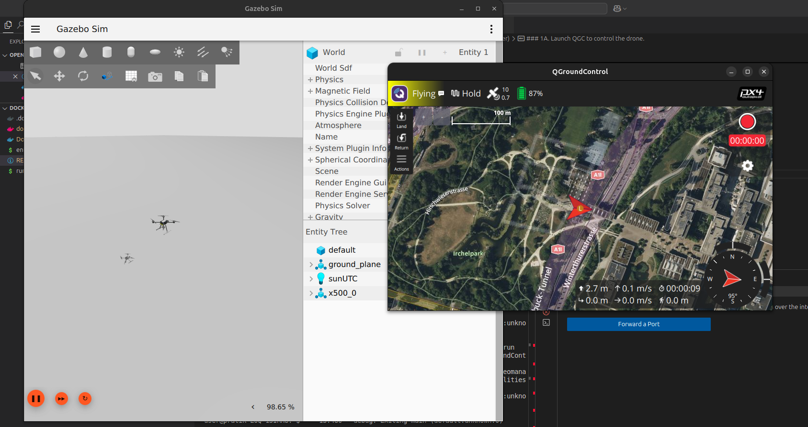

# PX4 + Gazebo Harmonic + ROS 2 Jazzy — Docker

A Docker container for PX4 SITL simulation with Gazebo Harmonic and ROS 2 Jazzy on Ubuntu 24.04.




## What's inside

| Component              | Version / Branch       |
|------------------------|------------------------|
| Ubuntu                 | 24.04 (Noble)          |
| Gazebo                 | Harmonic (LTS)         |
| ROS 2                  | Jazzy Jalisco          |
| PX4-Autopilot          | main                   |
| Micro XRCE-DDS Agent   | latest                 |
| px4_msgs / px4_ros_com | latest                 |

## Prerequisites

- **Docker** (≥ 24.0) and **Docker Compose** (v2)
- **Linux host** with X11 (for GUI mode)
- (Optional) **NVIDIA GPU** with [NVIDIA Container Toolkit](https://docs.nvidia.com/datacenter/cloud-native/container-toolkit/install-guide.html) for hardware-accelerated rendering

## Quick start

```bash
# Clone or copy this folder, then:
chmod +x run.sh
./run.sh
```

Or manually:

```bash
# Allow X11 from Docker
xhost +local:docker

# Build & start
docker compose up -d --build

# Open a shell
docker compose exec px4_gz bash
```

## Usage (inside the container)

### 1. Launch PX4 SITL with Gazebo

```bash
cd ~/PX4-Autopilot
make px4_sitl gz_x500
```
Other vehicle targets: `gz_x500_depth`, `gz_x500_mono_cam`, `gz_rc_cessna`, `gz_standard_vtol`, etc.

### 1A. Launch QGC to control the drone.

```bash
/opt/QGroundControl.AppImage --appimage-extract-and-run
```

### 2. Start Micro XRCE-DDS Agent (new terminal)

```bash
docker compose exec px4_gz bash
MicroXRCEAgent udp4 -p 8888
```

### 3. Use ROS 2 topics (new terminal)

```bash
docker compose exec px4_gz bash
ros2 topic list
ros2 topic echo /fmu/out/vehicle_status
```

## NVIDIA GPU acceleration

Uncomment the GPU sections in `docker-compose.yml`:

1. The `NVIDIA_VISIBLE_DEVICES` and `NVIDIA_DRIVER_CAPABILITIES` environment variables
2. The `deploy.resources.reservations.devices` block

Then rebuild: `docker compose up -d --build`

## Headless mode

If you don't need the Gazebo GUI, prefix with `HEADLESS=1`:

```bash
cd ~/PX4-Autopilot
HEADLESS=1 make px4_sitl gz_x500
```

## Customization

### Pin a PX4 version

In the Dockerfile, change the `git clone` branch:

```dockerfile
RUN git clone --recursive https://github.com/PX4/PX4-Autopilot.git \
        --branch v1.16.0 --depth 1 ~/PX4-Autopilot
```

### Mount your own workspace

Uncomment in `docker-compose.yml`:

```yaml
volumes:
  - ./workspace:/home/user/workspace
```

### Custom world or model

Place SDF files in `PX4-Autopilot/Tools/simulation/gz/worlds/` or `models/`, or set:

```bash
export GZ_SIM_RESOURCE_PATH=/path/to/your/models
```

## Troubleshooting

| Problem | Fix |
|---------|-----|
| `cannot open display` | Run `xhost +local:docker` on host |
| Gazebo renders black/crashes | Enable NVIDIA GPU section or use `HEADLESS=1` |
| `ninja: error: unknown target 'gz_x500'` | Run `make distclean` then retry |
| Slow first build | Normal — PX4 is a large codebase. Subsequent builds use cache. |

## Stopping

```bash
docker compose down        # stop & remove container
docker compose down -v     # also remove build cache volume
```
